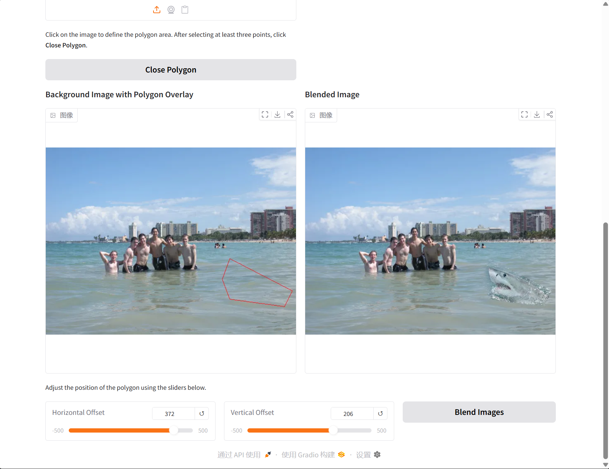
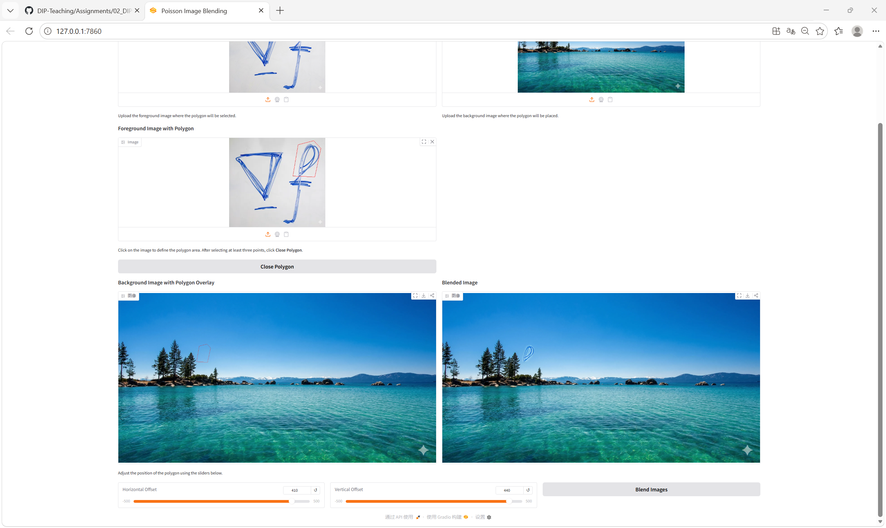
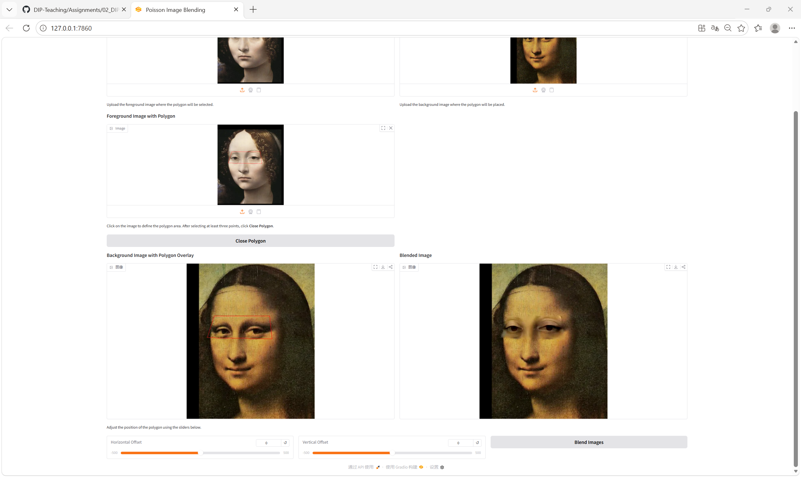
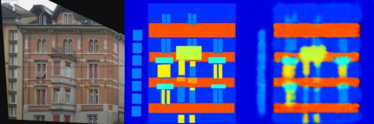
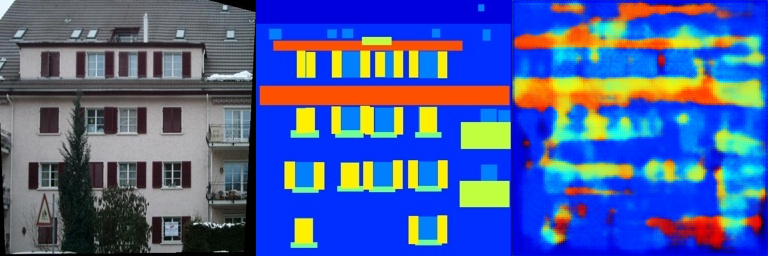

# Assignment 2 - DIP with PyTorch

本仓库完成了第二次作业的全部代码内容，主要包括传统 DIP（Poisson Image Editing）和基于深度学习的 DIP（Pix2Pix）两部分。


## 环境配置

安装依赖：

```bash
pip install torch gradio numpy pillow opencv-python
```

### 运行环境

- Python: 3.14.3
- 主要依赖：`torch`、`gradio`、`numpy`、`pillow`
- Pix2Pix 额外依赖：`opencv-python`

### 数据集准备

Pix2Pix 部分使用 facades 数据集。

```bash
cd Assignments/02_DIPwithPyTorch/Pix2Pix
bash download_facades_dataset.sh
```

当前工作区中的实际数据统计如下：

- `train_list.txt` 包含 400 张训练图像
- `val_list.txt` 包含 100 张验证图像
- `datasets/facades/` 已完成下载与解压

## 训练过程

### 1. Poisson 图像融合

运行交互式融合演示：

```bash
python run_blending_gradio.py
```

实现过程包括：

- 多边形点击选择与闭合
- 多边形到二值 mask 的生成
- 基于拉普拉斯算子的融合约束
- PyTorch Jacobi 迭代求解
- Gradio 交互界面展示

### 2. Pix2Pix

运行训练脚本：

```bash
python train.py
```

网络结构采用一个全卷积编码器-解码器：

- 编码端共有 5 层卷积
- 解码端共有 5 层反卷积
- 最后一层使用 `Tanh` 输出 3 通道 RGB 图像

训练参数如下：

- batch size: 100
- optimizer: Adam
- learning rate: 0.001
- betas: (0.5, 0.999)
- scheduler: StepLR(step_size=200, gamma=0.2)
- total epochs: 300

## 结果评估

### Poisson 图像融合








### Pix2Pix

通过训练过程中保存的 `train_results` 和 `val_results` 中的输入、目标和生成图像进行比较评估。

训练集最后一组结果：



验证集最后一组结果：




实际生成结果显示：

- 模型能够学到建筑物的大致轮廓和水平结构
- 目标图像的整体布局可以被恢复出来
- 细节仍然较模糊，颜色块状感较明显

## 预训练模型

本作业未额外提供预训练模型。

训练过程中保存的 checkpoint 如下：

- `checkpoints/pix2pix_model_epoch_50.pth`
- `checkpoints/pix2pix_model_epoch_100.pth`
- `checkpoints/pix2pix_model_epoch_150.pth`
- `checkpoints/pix2pix_model_epoch_200.pth`
- `checkpoints/pix2pix_model_epoch_250.pth`
- `checkpoints/pix2pix_model_epoch_300.pth`

## 实验结果

### Poisson 图像融合

- 多边形 mask 生成和基于拉普拉斯的融合流程运行正常。
- Gradio 演示可生成自然过渡的融合结果。

### Pix2Pix

- 训练成功运行到 300 个 epoch。
- 最终 epoch 的验证损失约为 `0.4386`。
- `train_results` 和 `val_results` 均按每 5 个 epoch 保存一次结果图，共生成 60 组结果目录。

## 结论

本次作业所需的代码已经补齐，两个任务均可正常运行，并且训练流程已经完成验证。

Poisson 融合和 Pix2Pix 训练都已经跑通；如果继续提升效果，可以进一步增强 Pix2Pix 网络结构、使用更大的数据集，或者优化 Poisson 融合求解过程。
