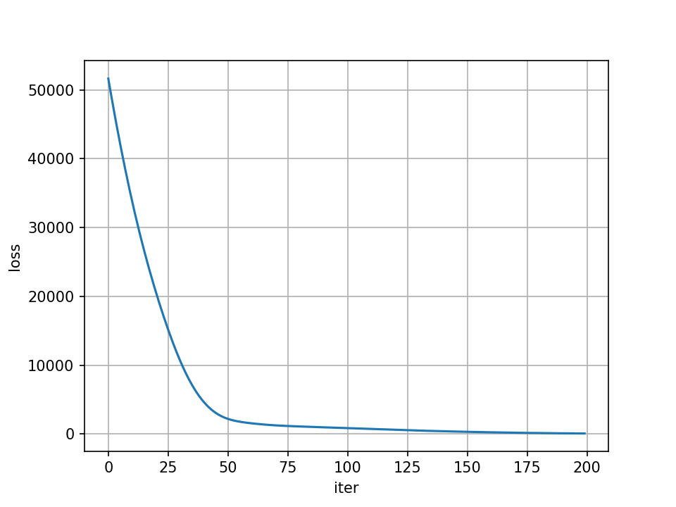
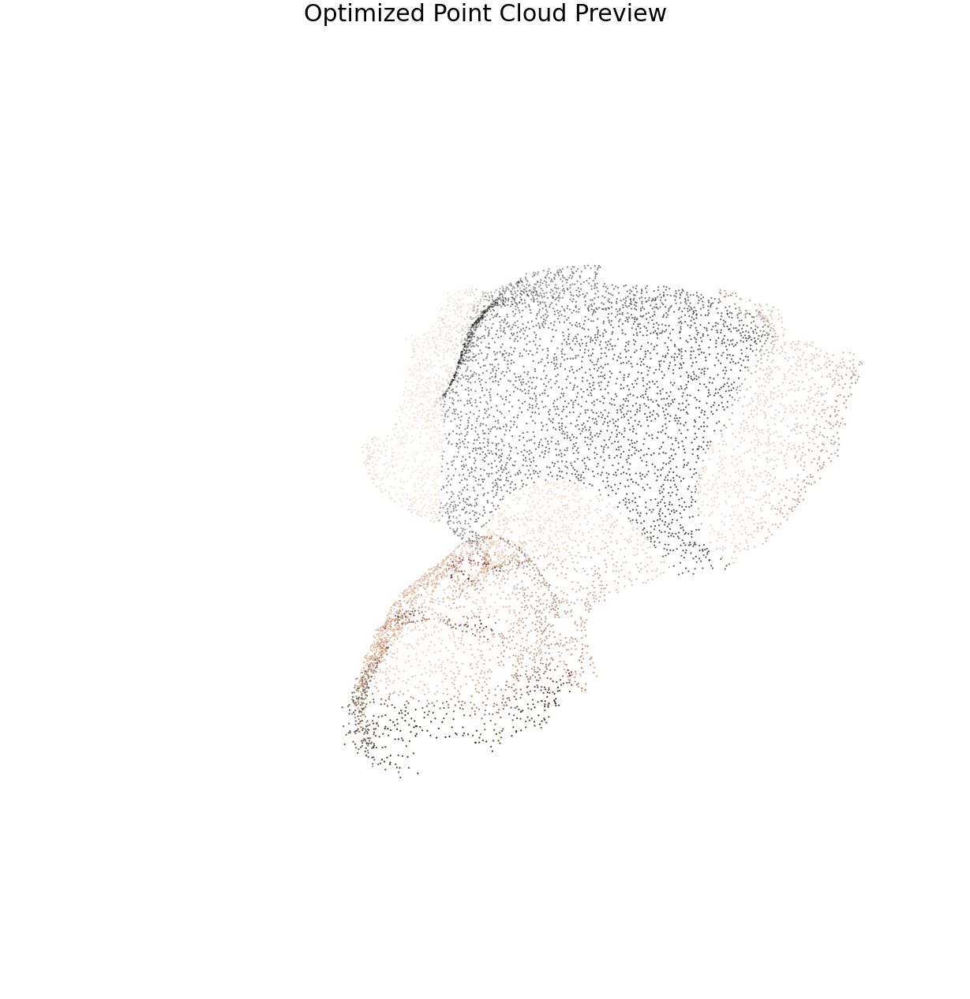
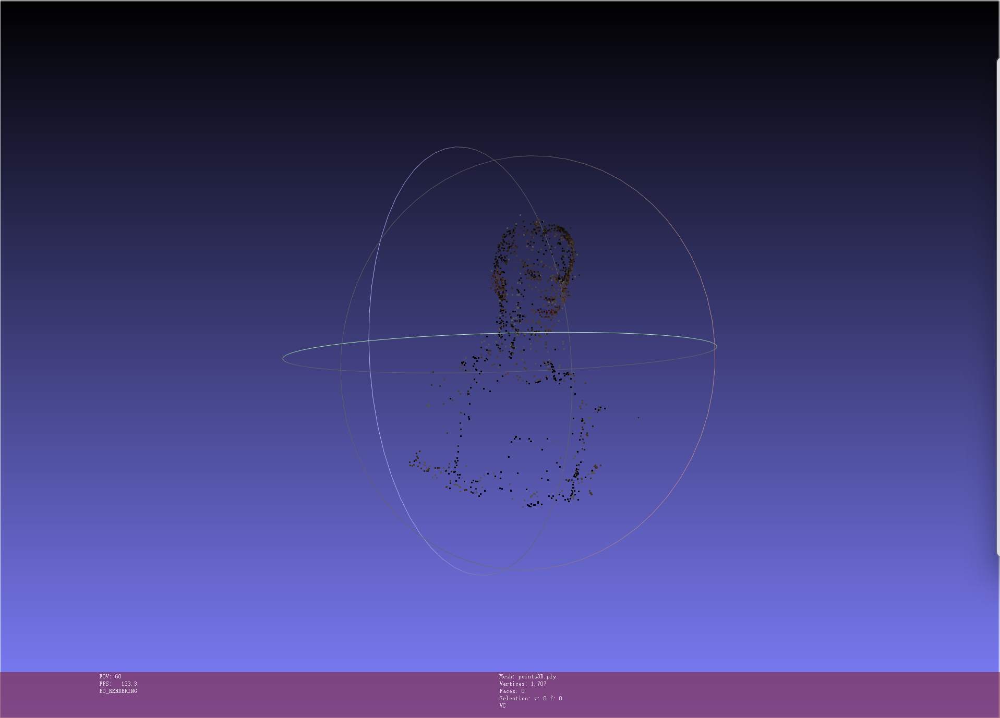

# Assignment 3 - Bundle Adjustment

### In this assignment, you will implement Bundle Adjustment with PyTorch and use COLMAP to perform 3D reconstruction from multi-view images.

### Resources:
- [Teaching Slides](https://pan.ustc.edu.cn/share/index/66294554e01948acaf78)
- [Bundle Adjustment — Wikipedia](https://en.wikipedia.org/wiki/Bundle_adjustment)
- [PyTorch Optimization](https://pytorch.org/docs/stable/optim.html)
- [pytorch3d.transforms](https://pytorch3d.readthedocs.io/en/latest/modules/transforms.html)
- [COLMAP Documentation](https://colmap.github.io/)
- [COLMAP Tutorial](https://colmap.github.io/tutorial.html)

### 1. Task 1: Bundle Adjustment using PyTorch

Implement a reprojection-error based optimization that jointly estimates:
- Shared focal length `f`
- Per-view camera extrinsics `R, T`
- All 3D point coordinates

Key camera convention used in the assignment:
- `[Xc, Yc, Zc] = R @ [X, Y, Z]^T + T`
- `u = -f * Xc / Zc + cx`
- `v = f * Yc / Zc + cy`
- `cx = image_width / 2`, `cy = image_height / 2`
- Rotation is parameterized by Euler angles

Implementation files:
- [bundle_adjustment.py](bundle_adjustment.py)
- [requirements.txt](requirements.txt)

Outputs in this folder:
- [optimized_points.obj](optimized_points.obj)
- [loss_curve.png](loss_curve.png)
- [point_cloud_preview.png](point_cloud_preview.png)

### Requirements

To install requirements:

```bash
python -m pip install -r requirements.txt
```

### Running

To run Bundle Adjustment, use:

```bash
python bundle_adjustment.py --n_iters 200 --lr 1e-2 --data_dir ./data --device cpu
```

If a CUDA-capable GPU is available, you can run:

```bash
python bundle_adjustment.py --n_iters 200 --lr 1e-2 --data_dir ./data --device cuda
```

### Results

### Loss Curve


### Optimized Point Cloud Preview


### 2. Task 2: Bundle Adjustment using COLMAP

Use COLMAP to reconstruct the scene from `data/images/`.

The provided script is:
- [run_colmap.sh](run_colmap.sh)
- [run_colmap_windows.ps1](run_colmap_windows.ps1)

It covers the standard pipeline:
1. Feature extraction
2. Feature matching
3. Sparse reconstruction / mapper
4. Image undistortion
5. Patch Match Stereo
6. Stereo fusion

### Running

```bash
bash run_colmap.sh
```

Windows PowerShell:

```powershell
powershell -ExecutionPolicy Bypass -File .\run_colmap_windows.ps1 -BaseDir .
```

### Results

Reconstruction statistics:
- Registered images: `50 / 50`
- Sparse points: `1707`
- Dense fused points: `0`

### Task 2 Screenshot 


### Acknowledgement

> Thanks to the assignment slides and COLMAP documentation for the problem setup and reconstruction pipeline.
